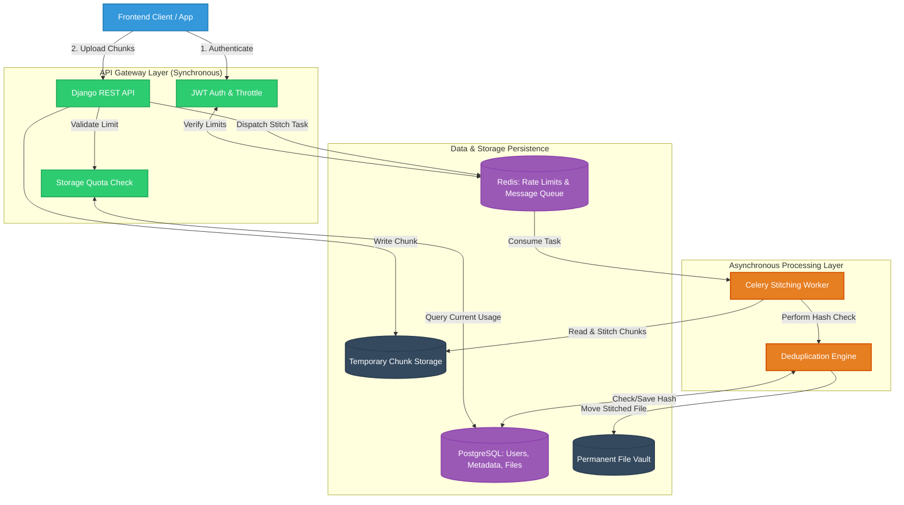
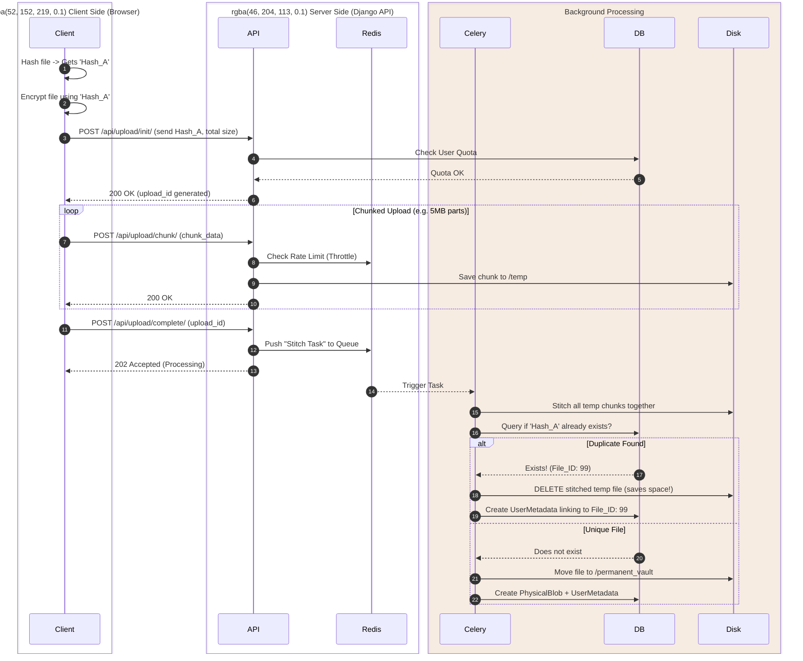

# Abnormal File Vault - Comprehensive Architecture & Project Plan

## 1. Executive Summary & Vision
**Abnormal File Vault** is an enterprise-grade, highly secure, and resource-conscious file hosting backend designed to win technical competitions. It transcends standard CRUD operations by solving the complex paradox between **End-to-End Encryption (E2EE)** and **Server-Side File Deduplication**.

Through the implementation of **Zero-Knowledge Convergent Encryption**, **Asynchronous Chunked Uploads**, and robust **Rate & Storage Limitation**, the system guarantees maximum user privacy, optimized server disk usage, and bulletproof protection against abuse.

---

## 2. Comprehensive Technology Stack
*   **Core Backend:** Python 3.11+
*   **Web Framework:** Django 5.x & Django REST Framework (DRF)
*   **Database Engine:** PostgreSQL 15+ (Relational mapping, metadata, quotas)
*   **In-Memory Store / Broker:** Redis 7+ (Token-bucket rate limiting, Celery message broker)
*   **Asynchronous Processing:** Celery (Background workers for chunk stitching, hashing, and deduplication)
*   **Authentication:** JWT (JSON Web Tokens) via `djangorestframework-simplejwt`
*   **Infrastructure:** Docker & Docker Compose (Containerized for seamless deployment)

---

## 3. Core System Architecture

The architecture is explicitly decoupled. The API layer responds instantly to users, while heavy operations (like stitching 5GB files and performing cryptographic hash checks) are offloaded to background Celery workers.

---

## 4. Deep Dive: Zero-Knowledge Deduplication Workflow

To have both Deduplication (saving server space) and Privacy (server can't read files), we use **Convergent Encryption**. The encryption key is the file's own hash. 

### The Protocol (Step-by-Step):
1. **Client-Side:** User selects `document.pdf`.
2. **Client-Side:** App calculates `SHA-256(document.pdf)` = `Hash_A`.
3. **Client-Side:** App encrypts `document.pdf` using `Hash_A` as the AES-256 password -> Results in `Encrypted_Blob`.
4. **Transport:** App uploads `Encrypted_Blob` in 5MB chunks, providing `Hash_A` to the server as the unique identifier.
5. **Server-Side:** Django receives chunks. Celery stitches them together.
6. **Server-Side Deduplication:** Celery queries PostgreSQL for `Hash_A`. 
    * *If exists:* The server discards the uploaded chunks and simply maps the user to the existing physical file.
    * *If not exists:* The server saves the `Encrypted_Blob` permanently and logs `Hash_A`.

---

## 5. Database Architecture (Models)

To support deduplication, we must separate the **Physical File** from the **User's File Metadata**.

### A. `User` (Standard Django Auth Model)
*   `id`, `username`, `email`, `password`
*   `storage_quota_bytes`: Integer (Default: 1GB)

### B. `PhysicalBlob` (The actual unique file on disk)
*   `file_hash`: CharField (Primary Key, SHA-256)
*   `file_path`: FileField (Location on server disk / S3)
*   `size_bytes`: BigIntegerField
*   `created_at`: DateTimeField

### C. `FileMetadata` (What the user sees in their UI)
*   `id`: UUID
*   `user`: ForeignKey -> `User`
*   `blob`: ForeignKey -> `PhysicalBlob`
*   `original_filename`: CharField (e.g., "vacation.jpg")
*   `extension`: CharField (e.g., ".jpg")
*   `uploaded_at`: DateTimeField
*   `tags`: JSONField (For custom search filtering)

---

## 6. API Endpoint Contract

| Method | Endpoint | Description |
| :--- | :--- | :--- |
| `POST` | `/api/auth/register/` | Create a new user account. |
| `POST` | `/api/auth/login/` | Returns JWT Access & Refresh tokens. |
| `POST` | `/api/upload/init/` | Declare intent to upload. Checks quota, returns `upload_id`. |
| `POST` | `/api/upload/chunk/` | Upload a specific file block (part 1, part 2...). |
| `POST` | `/api/upload/complete/` | Signal all chunks sent. Triggers Celery worker. |
| `GET` | `/api/files/` | Search/List files. Accepts filters (`?ext=.pdf&size_gt=5000`). |
| `GET` | `/api/files/{id}/download/` | Fetch the encrypted file blob. |
| `DELETE` | `/api/files/{id}/` | Delete metadata. (Only deletes `PhysicalBlob` if 0 users link to it). |

---

## 7. Development Roadmap

**Phase 1: Foundation (Docker & Django)**
*   Set up Docker Compose with PostgreSQL and Redis.
*   Initialize Django, create Custom User models, and configure JWT Auth.

**Phase 2: Core Models & Quotas**
*   Build the `PhysicalBlob` and `FileMetadata` database schema.
*   Implement custom DRF middleware to calculate total user storage and enforce the storage quota limit.

**Phase 3: The Deduplication Engine (Celery)**
*   Implement chunked upload endpoints.
*   Configure Celery background workers.
*   Write the Python script that stitches chunks, reads the Hash, checks the database, and executes the deduplication logic.

**Phase 4: Search, Filters, & Polish**
*   Implement `django-filter` to allow complex file queries.
*   Implement Redis token-bucket rate limiting on all endpoints to prevent API abuse.
*   Write comprehensive Unit Tests.
