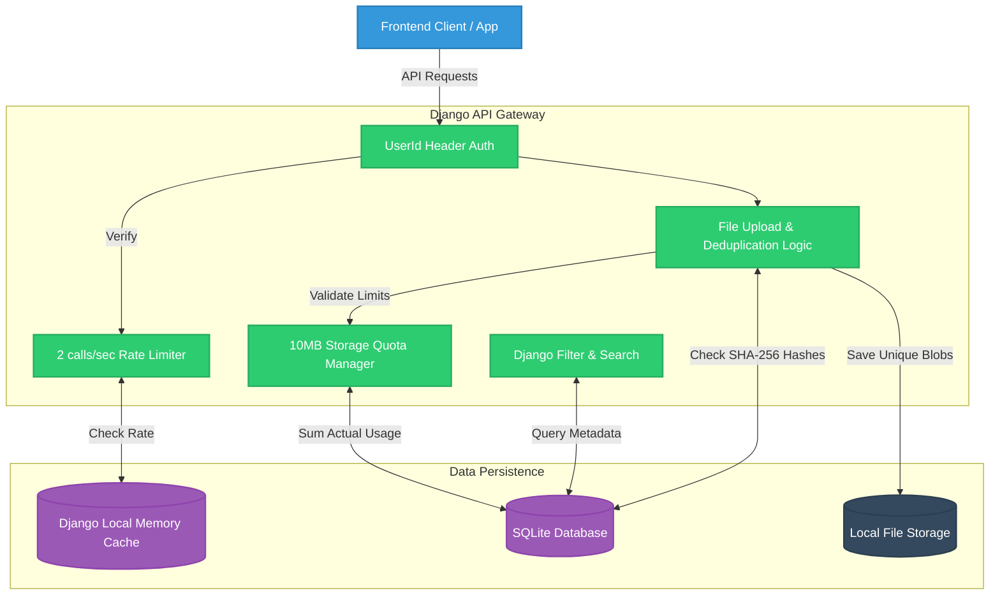

# Abnormal File Vault - API Product Requirements & Architecture

## 1. Overview
Abnormal File Vault is a file hosting application designed to optimize storage efficiency and enhance file retrieval through deduplication and intelligent search capabilities. The project consists of a Django backend and API, containerized using Docker for easy setup and deployment.

## 2. Business Case
As Abnormal AI continues to build AI-powered security solutions, efficient data storage and retrieval are essential for managing files, reports, and forensic evidence related to cybersecurity threats. A smart file management system like Abnormal File Vault provides:
*   **Optimized Storage** – Reducing redundancy through deduplication lowers storage costs and improves performance.
*   **Faster Incident Investigations** – A powerful search and filtering system enables security teams to retrieve relevant files quickly.
*   **Scalability & Performance** – Handling large datasets efficiently ensures seamless operations as the system scales.

## 3. Technical Requirements
*   **Backend:** Python 3.11+ with Django 5.x & Django REST Framework (DRF)
*   **Database:** SQLite
*   **Containerization:** Docker & Docker Compose
*   **Authentication:** Custom HTTP Header (`UserId`)

---

## 4. System Architecture

---

## 5. Core Features & Functionality

### A. File Deduplication System
*   **Objective:** Optimize storage efficiency by detecting and handling duplicate file uploads.
*   **Mechanism:** When a file is uploaded (`POST /api/files/`), the server calculates its SHA-256 hash.
*   **Process:**
    *   If the hash is **unique**, the physical file is saved to disk.
    *   If the hash **exists**, the physical upload is discarded. Instead, a database reference is created (`is_reference=True`, `reference_count` incremented) pointing to the original file.
*   **Tracking:** Storage savings are tracked and displayed via the `/api/files/storage_stats/` endpoint.

### B. Search & Filtering System
*   **Objective:** Enable efficient retrieval of stored files.
*   **Mechanism:** Integrated `django-filter` to allow complex, simultaneous query parameters on `GET /api/files/`:
    *   `search`: Case-insensitive partial match on filename.
    *   `file_type`: Exact match on MIME type.
    *   `min_size` / `max_size`: Range filtering on byte size.
    *   `start_date` / `end_date`: Date-range filtering using ISO 8601 formats.

### C. Call & Storage Limit Implementation
*   **Objective:** Protect application health programmatically.
*   **Rate Limits:** Users are limited to **2 calls per 1 second** (Tracked via the `UserId` header). Exceeding this triggers a `429 Too Many Requests` with message `"Call Limit Reached"`.
*   **Storage Quotas:** Each user is limited to **10MB** of actual storage. The system calculates the sum of all their non-referenced files. If an upload pushes them over this limit, it triggers a `429 Too Many Requests` with message `"Storage Quota Exceeded"`.

---

## 6. API Contract

| Method | Endpoint | Description |
| :--- | :--- | :--- |
| `GET` | `/api/files/` | List files. Supports query parameters (`search`, `file_type`, `min_size`, etc.). |
| `POST` | `/api/files/` | Upload a new file. Automatically performs SHA-256 deduplication and quota checks. |
| `GET` | `/api/files/{id}/` | Get detailed metadata for a specific file. |
| `DELETE` | `/api/files/{id}/` | Delete a file reference. Only deletes physical file if `reference_count` hits 0. |
| `GET` | `/api/files/storage_stats/` | Returns `total_storage_used`, `original_storage_used`, and `savings_percentage`. |
| `GET` | `/api/files/file_types/` | Returns a flat array of unique MIME types the user has uploaded. |
